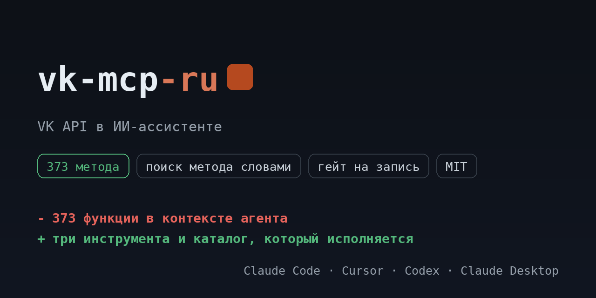

# vk-mcp-ru

<!-- mcp-name: io.github.ilyautov/vk-mcp-ru -->

VK API для ИИ-ассистентов: товары магазина сообщества, посты, рекламные кампании и статистика, диалоги с клиентами, лид-формы. Каталог из официальной схемы, у каждого метода класс доступа.

[](https://pypi.org/project/vk-mcp-ru/)
[](https://github.com/ilyautov/vk-mcp-ru/actions/workflows/ci.yml)
[](LICENSE)
[](#карта-методов)
[](https://business-mcp-ru.aifrontier.tech/vk-api.html)
[](https://github.com/ilyautov/vk-mcp-ru/stargazers)

[](https://vscode.dev/redirect/mcp/install?name=vk&config=%7B%22command%22%3A%20%22uvx%22%2C%20%22args%22%3A%20%5B%22vk-mcp-ru%22%5D%2C%20%22env%22%3A%20%7B%22VK_TOKEN%22%3A%20%22%24%7Binput%3Avk_token%7D%22%7D%7D&inputs=%5B%7B%22id%22%3A%20%22vk_token%22%2C%20%22type%22%3A%20%22promptString%22%2C%20%22description%22%3A%20%22%D0%A1%D0%B5%D1%80%D0%B2%D0%B8%D1%81%D0%BD%D1%8B%D0%B9%20%D0%BA%D0%BB%D1%8E%D1%87%20%D0%BF%D1%80%D0%B8%D0%BB%D0%BE%D0%B6%D0%B5%D0%BD%D0%B8%D1%8F%20VK%20%D0%B8%D0%BB%D0%B8%20%D1%82%D0%BE%D0%BA%D0%B5%D0%BD%20%D1%81%D0%BE%D0%BE%D0%B1%D1%89%D0%B5%D1%81%D1%82%D0%B2%D0%B0%20%D1%81%20%D0%BD%D1%83%D0%B6%D0%BD%D1%8B%D0%BC%D0%B8%20%D0%BF%D1%80%D0%B0%D0%B2%D0%B0%D0%BC%D0%B8.%22%2C%20%22password%22%3A%20true%7D%5D)
[](https://cursor.com/en/install-mcp?name=vk&config=eyJjb21tYW5kIjogInV2eCIsICJhcmdzIjogWyJ2ay1tY3AtcnUiXSwgImVudiI6IHsiVktfVE9LRU4iOiAiIn19)

<p align="center">
  <a href="https://business-mcp-ru.aifrontier.tech/">
    
  </a>
</p>

Каталог собран из первоисточника (официальная схема `VKCOM/vk-api-schema`) и лежит в репозитории как
`vk_mcp/endpoints.yaml`: **373 метода**, из них 159 на чтение,
173 на запись и 41 необратимых. Сервер исполняет ровно этот файл,
поэтому таблица ниже не может разойтись с кодом.

## Установка

```bash
uvx vk-mcp-ru
```

Claude Desktop, `claude_desktop_config.json`:

```json
{
  "mcpServers": {
    "vk-mcp": {
      "command": "uvx",
      "args": ["vk-mcp-ru"],
      "env": { "VK_TOKEN": "..." }
    }
  }
}
```

## Ключи

dev.vk.com → приложение → сервисный ключ доступа, либо токен сообщества с правами market, messages, ads, stats. Запрашивайте только те права, которые реально нужны.

| переменная | секрет | что это |
|---|---|---|
| `VK_TOKEN` | да | Сервисный ключ приложения VK или токен сообщества с нужными правами. |

Ключи можно не держать в окружении: сервер умеет кабинеты и кладёт их в
`~/.ru-mcp/cabinets.json` с правами 600, вне репозитория.

## Карта методов

| раздел | методов | чтение | запись | необратимое |
|---|---|---|---|---|
| Сообщества | 51 | 20 | 25 | 6 |
| Диалоги | 48 | 21 | 22 | 5 |
| Реклама | 47 | 24 | 16 | 7 |
| Товары и магазин | 45 | 16 | 23 | 6 |
| Фотографии | 44 | 18 | 22 | 4 |
| Видео | 34 | 9 | 20 | 5 |
| Записи на стене | 25 | 7 | 16 | 2 |
| Обсуждения | 13 | 2 | 9 | 2 |
| Документы | 12 | 7 | 4 | 1 |
| Вики-страницы | 8 | 4 | 4 | 0 |
| Лид-формы | 7 | 3 | 3 | 1 |
| Заказы | 7 | 5 | 2 | 0 |
| Утилиты | 7 | 6 | 0 | 1 |
| Карточки в записях | 6 | 3 | 2 | 1 |
| Пользователи | 5 | 4 | 1 | 0 |
| VK Donut | 4 | 4 | 0 | 0 |
| Статистика | 3 | 2 | 1 | 0 |
| Хранилище приложения | 3 | 2 | 1 | 0 |
| Уведомления | 3 | 1 | 2 | 0 |
| Подкасты | 1 | 1 | 0 | 0 |
| **всего** | **373** | **159** | **173** | **41** |

## Как это выглядит в чате

Вы: посты на стене сообщества

```
vk_search_methods("посты на стене сообщества")
  vk_wall_get        POST /method/wall.get      чтение
  vk_wall_search     POST /method/wall.search   чтение
  vk_wall_get_by_id  POST /method/wall.getById  чтение

vk_describe_method("vk_wall_get")
  Returns a list of posts on a user wall or community wall.
  POST api.vk.com/method/wall.get
  параметры: domain, offset, count, filter, extended, fields
  класс доступа: чтение

vk_call_method("vk_wall_get", {"domain": "...", "offset": "..."})
```

Три инструмента вместо 373 функций: агент ищет метод словами,
читает его карточку и вызывает. Запись и необратимое спрашивают подтверждение.

Что обычно просят:

- Свести заказы и товары магазина сообщества в таблицу.
- Посмотреть статистику сообщества и постов за период.
- Собрать расходы и показатели рекламных кампаний VK Ads.
- Разобрать непрочитанные диалоги и подготовить ответы на согласование.

## Безопасность

Сервер работает на машине пользователя, ключи наружу не уходят. У методов три
класса доступа: чтение идёт сразу, запись и необратимые действия требуют
подтверждения. Заголовок авторизации не покидает домены сервиса даже при вызове
произвольного пути.

## Проверить установку

```bash
uvx vk-mcp-ru doctor
```

Печатает, сколько методов загрузилось, найдены ли ключи и откуда. Секреты не
показывает. С `--live` делает один дешёвый реальный вызов на чтение.

## Родня

Ядро вынесено в [schema-mcp-core](https://github.com/ilyautov/schema-mcp-core).
Соседние серверы: [hh-mcp-ru](https://github.com/ilyautov/hh-mcp-ru), [diadoc-mcp-ru](https://github.com/ilyautov/diadoc-mcp-ru), [sbis-mcp-ru](https://github.com/ilyautov/sbis-mcp-ru), [chestny-znak-mcp-ru](https://github.com/ilyautov/chestny-znak-mcp-ru).
Маркетплейсы живут отдельно: [marketplaces-mcp-ru](https://github.com/ilyautov/marketplaces-mcp-ru).

MIT. Автор [Илья Утов](https://github.com/ilyautov).
